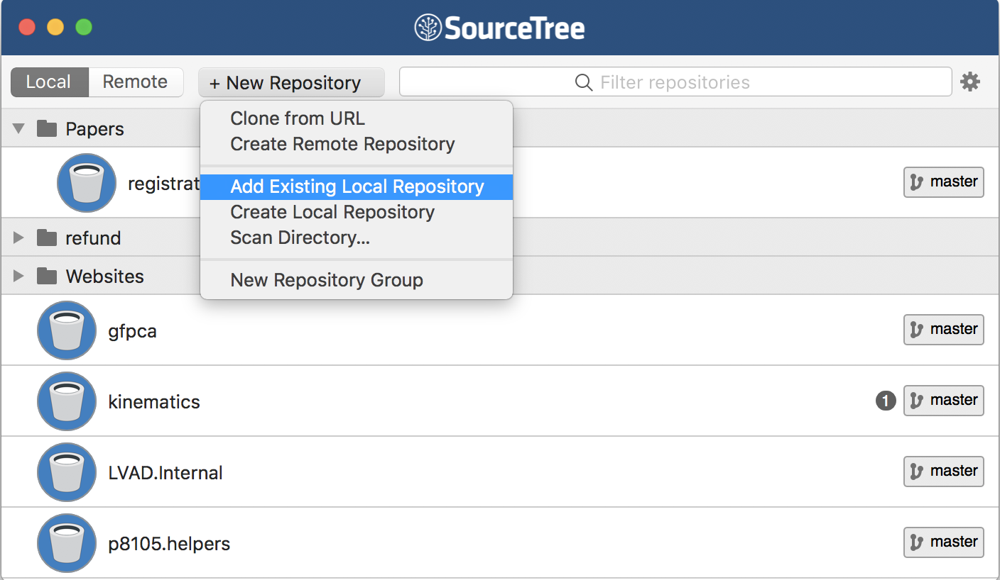

This is the first module in the [Collaboration](topic_collaboration.html) topic; the relevant slack channel is [here](https://p8105-fall2017.slack.com/messages/C7G7KR6MP).

## Some slides

 <strong> <a href="https://speakerdeck.com/jeffgoldsmith/dsi-git-and-github" title="Git and GitHub" target="_blank">Git and GitHub</a> </strong> from <strong><a href="https://speakerdeck.com/jeffgoldsmith" target="_blank">Jeff Goldsmith</a></strong>. 

## Example

In the following, I'm skipping past some important set-up steps. To follow along, you'll first need to install relevant software (Git and a Git Client -- I use [Sourcetree](https://www.sourcetreeapp.com)), connected Git with RStudio, and created a GitHub account. Instructions for doing all that can be found in Chapters 4-9 of [this book](http://happygitwithr.com) by Jenny Bryan (note -- all the rest of those chapters are also great).

For this example, I'm going to re-do the example from [What is Data Science: Part II](what_is_ds_ii.html), starting from [this outline](resources/nyc_airbnb_outline.Rmd).

### New workflow

The last time we talked about a good workflow was in [writing with data](writing_with_data.html); we'd introduced R Projects and R Markdown, and focused on working as a lone analyst. We're shifting version control using git; this is useful by itself, and also a popular approach to collaboration. Our new workflow will be:

* Create a directory with a reasonable name and path (e.g. `~/Documents/School/DSI/Homework_2/`)
* Put an R Project in the directory
* **Turn on version control for the project using git**
* **Add the directory to your git client (and, optionally, create remote repository)**
* Keep everything related to the analysis -- data inputs, scripts, reports, output -- in the directory, and use R Markdown as much as possible
* **Keep track of changes using version control**
* Periodically check for reproducibility of the analysis

The bold steps are new. 

To turn on version control in an R Project through R Studio, use Tools > Version Control > Project setup. 

Select Git.

Once you've done this, a few things will happen. Most obviously, you now have a `.gitignore` file in your project; by default, this will ignore `.Rproj.user`, `.Rhistory`, `.RData`, and `.Ruserdata`. You can add other things to be ignored if you want. Less obviously, git is now watching your directory and will keep track of changes across versions of your work.

Next I'll add the R Project to my git client. You can at this stage also create a remote repository, but I'll hold off for a while. 

You don't _have_ to initialize git through RStudio; you could use your git client. I prefer to do it this way because RStudio will create a useful `.gitignore` file in your directory. You also don't have to add your directory to your git client -- RStudio has a bare-bones client built in, and I often use this for short-term projects. 

### Commit to git

At this point, I haven't done much "work" -- I've created a directory, launched a project, initialized a git repo, and added it to my client. Although I haven't really done much yet, I'm going to make an initial commit for the project, sort of as a starting point.

Now I'll start actually doing stuff. As I noted above, I'm going to repeat the analysis we did in [What is Data Science: Part II](what_is_ds_ii.html) -- my goal is to focus on the git side of things without distractions from new code. As a first step, I'll add the outline of the analysis and commit.

Next I'll add my [data file](data/nyc_airbnb.zip) and commit.

Next I'll add a code chunk doing the data cleaning. And commit.

How frequently you commit is, to some extent, a matter of taste. Roughly speaking, I commit after changes that are big enough to that I'd want a reminder about them in six months. Also, after a while, committing becomes almost second-nature (or at least isn't something that takes a lot of time or energy) and that makes it easier to commit often.

### GitHub

Git is useful all by itself in directories that exist only on your computer, but it is especially powerful when combined with GitHub. This combination relies on pairing your "local repository" with a "remote repository" -- local is on your computer, remote is in the cloud / on GitHub's servers.

So, I'll create a remote repo that is paired with my local repo. I often do this via the git client, using Right-click > Publish to remote. Alternatively, you can ask your client to create a remote repository when you add the local repository at the outset of the project.

Once you've done that, you'll be asked if you want to "push" to remote. This step drives home the difference between local and remote repositories: you can make local changes and commits, but the remote repository won't know about them until you push. 

To illustrate, I'll add some code to do data inspection, commit, and push; I can double check that this appears on [GitHub](https://github.com/jeff-goldsmith/git_example).

### Collaborating via GitHub

Sharing repositories via GitHub makes it possible to collaborate in a clear, rigorous way. As each person makes changes:

* written commit messages let others know what has changed and why
* line-by-line comparisons (additions and deletions) show exactly what was changed.

This is great if you're working in a team, or if you are considering future-you as a collaborator.

For the repository holding this example, I'll add Julia as a collaborator. Once she's been added, she's going to answer "Does rating vary by neighborhood, room type, or both?" in our analysis outline. She'll commit and push; I'll relax until she's done, then pull her changes from the remote repository to my local repository. Those changes will appear in my local repository, and a summary of the changes are in my git client. 

Of course, team members may want to work in parallel. As an example -- I'll tackle "Where are rentals located?" and Julia will address "Do hosts with more listings have higher or lower ratings?". Once I've written my code, I'm going to commit; pull to see if there are any changes in the remote repository; and then push everything.

This process (commit > pull > push) can help keep you out of trouble, although other approaches are possible.

### Conflicts

When we're working in parallel on non-overlapping elements, everything is pretty smooth. I can edit and commit, and so can Julia; as we cycle through the commit > pull > push, git knows we're not editing the same stuff and keeps track of the changes. 

We can run into issues when we both edit the same thing -- suppose, for example, we both try to add the discussion. If she commits and pushes before I do, when I commit and pull I'll see the following:

We've both written text in the same place, and have to make a decision about which to keep. We can do this with the help of a merge tool, which will show where differences are and allow us to make a choice about which to keep. 

After resolving conflicts, we should commit the changes and push the new unified version to the remote repository.

## Other materials

There's a lot of stuff to help with git in general, and with git for R in particular. This is a non-exhaustive list:

* Jenny Bryan's [article](https://peerj.com/preprints/3159/) "Excuse me, do you have a moment to talk about version control?" is excellent
* Jenny Bryan's [book](http://happygitwithr.com) (same as the link above)
* The [GitHub](https://guides.github.com/activities/hello-world/) guide
* Version control with [RStudio](https://support.rstudio.com/hc/en-us/articles/200532077-Version-Control-with-Git-and-SVN)

The GitHub repository I created working through this example is [here](https://github.com/jeff-goldsmith/git_example/).
