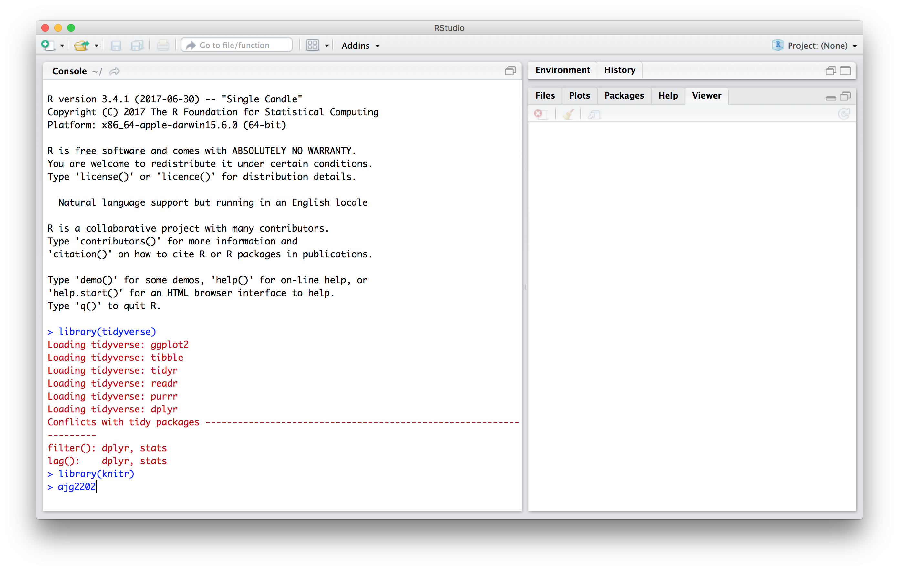

### Context

R and RStudio are required for this course, as are several R packages. The goal of this homework assignment is to ensure that you have installed relevant software and packages. 

### Due date

Due: September 11 at 1:00pm. 

### Problem 1

Download and install the latest versions of R (3.4.1) and RStudio (1.0.153). 

Install the packages `tidyverse` and `knitr` (and relevant dependencies) using the code below:

```{r eval = FALSE}
install.packages("tidyverse")
install.packages("knitr")
```

Upload a screenshot of RStudio thats show you can successfully load the packages `tidyverse` and `knitr`, and include your UNI on the command line. Here's an example "solution":


