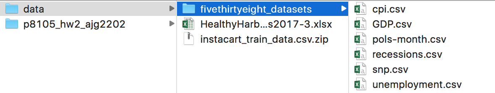

### Context

This assignment reinforces ideas in [Data Wrangling I](topic_data_wrangling_i.html). A PDF of this assignment is [here](homework_2.pdf).

### Due date

Due: October 10 at 5:00pm. 

### Points

* Problem 0: 20 points
* Problem 1: 30 points
* Problem 2: 30 points
* Problem 3: 20 points

### Problem 0

This "problem" focuses on structure of your assignment, including the use of R Markdown to write reproducible reports, the use of R Projects to organize your work, the use of relative paths to load data, and the naming structure for your files. 

To that end: 

* create a directory named `p8105_hw2_YOURUNI` (e.g. `p8105_hw2_ajg2202` for Jeff)
* put an R project in the directory
* create a single .Rmd file named `p8105_hw2_YOURUNI.Rmd`

Some of the datasets used in this homework are large, so you should not include raw data files in your directory. Instead, create a separate directory called `data` and use relative paths starting with `../data/` to load data. We'll have a similar directory and should be able to knit your R Markdown file. The screenshot below illustrates this configuration.

Your solutions to Problems 1+ should be included in your .Rmd file, and your submission for this assignment will be a zip file of the directory named `p8105_hw2_YOURUNI`.

We will assess adherence to the instructions above and whether we are able to knit your .Rmd -- that is, whether your work is reproducible -- in the grading of this problem. Adherence to appropriate styling and clarity of code will be assessed in Problems 1+.

### Problem 1

This problem uses the [Mr. Trash Wheel](./dataset_mr_trash_wheel.html) dataset, available as an Excel file on the course website. 

Read and clean the Mr. Trash Wheel sheet:

* specify the sheet in the Excel file and to omit columns containing notes (using the `range` argument and `cell_cols()` function) 
* use reasonable variable names 
* omit columns that do not include dumpster-specific data
* rounds the number of sports balls to the nearest integer and converts the result to an integer variable (using `as.integer`)

Read and clean precipitation data for 2016 and 2017. For each, omit rows without precipitation data and add a variable year. Next, combine datasets and convert month to a character variable (the variable `month.name` is built into R and should be useful).

Write a paragraph about these data; you are encouraged to use inline R. Be sure to note the number of observations in both resulting datasets, and give examples of key variables. For available data, what is the total precipitation in 2017? What was the median number of sports balls in a dumpster in 2016?

### Problem 2

This problem uses the [FiveThirtyEight](dataset_fivethirtyeight.html) data; these data were gathered to create the interactive graphic on [this page](https://fivethirtyeight.com/features/science-isnt-broken/#part1). In particular, we'll use the data in pols-month.csv, unemployment.csv, and snp.csv. Our goal is to merge these into a single data frame using year and month as keys across datasets. 

First, clean the data in pols-month.csv. Use `separate()` to break up the variable `mon` into integer variables `year`, `month`, and `day`; replace month number with month name as above; create a `president` variable taking values `gop` and `dem`, and remove `prez_dem` and `prez_gop`; and remove the day variable. 

Second, clean the data in snp.csv using a similar process to the above. For consistence across datasets, arrange according to year and month, and organize so that `year` and `month` are the leading columns. 

Third, tidy the unemployment data so that it can be merged with the previous datasets. This process will involve switching from "wide" to "long" format; ensuring that key variables have the same name; and ensuring that key variables take the same values. 

Join the datasets by merging snp into pols, and unemployment into the result. 

Write a short paragraph about these datasets. Explain briefly what each dataset contained, and describe the resulting dataset (e.g. give the dimension, range of years, and names of key variables). In Januarys in or after 1975 in which a democrat was president, what was the average unemployment rate? 

*Note: we could have used a `date` variable as a key instead of creating `year` and `month` keys; doing so would help with some kinds of plotting, and be a more accurate representation of the data. Date formats are tricky, though. For more information check out the `lubridate` package in the `tidyverse`.*

### Problem 3

This problem uses the [Instacart](dataset_instacart.html) data. Note that the data can be loaded as a zipped csv file by `read_csv()` -- no need to unzip the data first. 

The goal is to do some exploration of this dataset. To that end, answer or address the following:

* How many entries are in the dataset? How many unique orders? 
* Make a histogram of order hour for items from the produce department.
* How are aisles related to departments? Give some illustrative examples. Limiting your dataset to the relevant variables and using `distinct` (in addition to other functions) may be helpful.
* From what department are the most items ordered? From what department are the least items ordered?
* What is the median number of days since the prior order? Note that this is not necessary the median of the variable `days_since_prior_order`.
* What is the median hour of the day at which Pink Lady Apples are ordered? What about Coffee Ice Cream?
