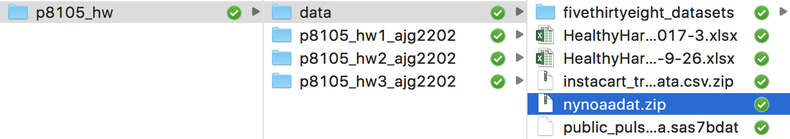
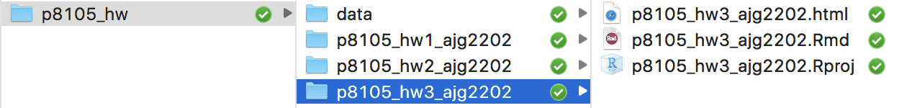

### Context

This assignment reinforces ideas in [Visualization and EDA](topic_visualization_and_eda.html). A PDF of this assignment is [here](homework_3.pdf).

### Due date

Due: October 11 at 5:00pm. 

### Points

* Problem 0: 10 points
* Problem 1: 30 points
* Problem 2: 30 points
* Problem 3: 30 points

### Problem 0

This "problem" focuses on structure of your assignment, including the use of R Markdown to write reproducible reports, the use of R Projects to organize your work, the use of relative paths to load data, and the naming structure for your files. 

To that end: 

* create a directory named `p8105_hw3_YOURUNI` (e.g. `p8105_hw3_ajg2202` for Jeff)
* put an R project in the directory
* create a single .Rmd file named `p8105_hw3_YOURUNI.Rmd`

Some of the datasets used in this homework are large, so you should not include raw data files in your directory. Instead, create a separate directory called `data` and use relative paths starting with `../data/` to load data. We'll have a similar directory and should be able to knit your R Markdown file. The screenshot below illustrates this configuration.

Your solutions to Problems 1+ should be included in your .Rmd file, and your submission for this assignment will be a zip file of the directory named `p8105_hw3_YOURUNI`. The required structure is shown below.

We will assess adherence to the instructions above and whether we are able to knit your .Rmd -- that is, whether your work is reproducible -- in the grading of this problem. Adherence to appropriate styling and clarity of code will be assessed in Problems 1+. This homework includes figures; the readability of your embedded plots (e.g. font sizes, axis labels, titles) will be assessed in Problems 1+. 

### Problem 1

This problem uses the PULSE dataset which appeared as an example in the [Data Wrangling I](topic_data_wrangling_i.html). 

Read and clean the PULSE dataset; omit observations for which BDI score wasn't measured.

* Briefly summarize the dataset. How many subjects are included? Make a table showing the number of subjects with observations at 1, 2, 3, or 4 visits. 
* Make a table showing showing the mean, median, and standard deviaion of the BDI score at each visit.
* Make box and violin plots showing the distribution of BDI score at each visit. Comment on the distribution of BDI score. 
* Covert visit to a numeric variable, and make a "speghetti plot" of BDI score. That is, make a scatterplot showing each subject's BDI score at each visit with lines connected repeated observations on the same subject. `geom_path()` will be useful. Based on this plot, comment on the stability of BDI score within a person over time -- do subjects with high BDI scores at baseline tend to have high BDI scores at 12 months? 

### Problem 2

This problem uses the [Instacart](dataset_instacart.html) data. Note that the data can be loaded as a zipped csv file by `read_csv()` -- no need to unzip the data first. 

The goal is to do some exploration of this dataset. To that end, answer or address the following:

* Produce a table showing how many items are ordered in each department, and limit this table to the seven departments from which the most items are ordered. 
* Make a table showing the most popular item in each department. 
* Make a table showing the mean hour of the day at which Pink Lady Apples and Coffee Ice Cream are ordered on each day of the week; format this table for human readers (i.e. produce a 2 x 7 table).
* Using violin and ridge plots, show the distribution of the order hour of the day for each department. Organize your plot according to the IQR of the order hour. Comment on the distributions, taking into account the which departments have the widest and narrowest IQRs. 

### Problem 3

This problem uses the [NY NOAA](dataset_noaa.html) data. Note that the data can be loaded as a zipped csv file by `read_csv()` -- no need to unzip the data first. 

The goal is to do some exploration of this dataset. To that end, answer or address the following:

* Write a short description of the dataset. How many observations are included? How many stations? How much missing data is there for `tmax` and `snow`? Does this vary by station?
* What year had the largest snowfall? Can you find information online that supports your finding?
* Limiting your data to observations with snowfall values greater than 0 and less than 100, make a ridge plot showing the distribution of snowfall values for each year. Comment on the recorded snowfall values -- are they clustered around specific entries? If so, why?
* Make a useful plot showing `tmax` against `tmin`. For these data, you might try a scatterplot, but it is unlikely to be "useful". 
* Separate the date variable into year, month, and day variables. For each station and month, average across year to obtain the station-specific monthly average `tmax`. Make a spaghetti plot showing the average `tmax` curve for each station. Comment on your plot.

