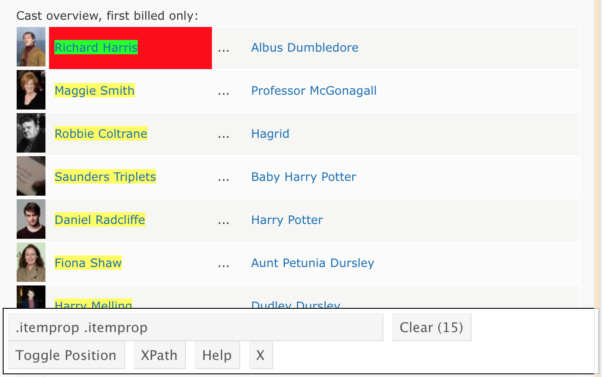

  
In [data import](data_import.html), we saw how to load data from a variety of formats; this is a fairly standard way to get data that have been gathered as part of a study. In a lot of cases, though, you're going to have to go out and get the data you want or need. That's what we're covering now.

This is the first module in the [Data Wrangling II](topic_data_wrangling_ii.html) topic; the relevant slack channel is [here](https://p8105-fall2017.slack.com/messages/C7N8HG34N).

```{r, echo = FALSE}
knitr::opts_chunk$set(
  collapse = TRUE,
  fig.width = 6,
  fig.asp = .6,
  out.width = "90%"
)
```

## Some slides

<script async class="speakerdeck-embed" data-id="849dc71f1d784a4a9af780e5c4ba16a2" data-ratio="1.33333333333333" src="//speakerdeck.com/assets/embed.js"></script>
<div style="margin-bottom:5px"> <strong> <a href="https://speakerdeck.com/jeffgoldsmith/dsi-reading-data-from-the-web" title="Reading Data from the Web" target="_blank">Reading Data from the Web</a> </strong> from <strong><a href="https://speakerdeck.com/jeffgoldsmith" target="_blank">Jeff Goldsmith</a></strong>. </div><br>


## Example

As always, it's good to start by figuring out how you want to organize you code for this content. I'll create a new directory called `example_data_wrangling_ii`, start an R Project, and open a new R Markdown file called `reading_data_from_the_web.Rmd`. I'll initialize Git and make the repo public on GitHub. Although we'll mostly be getting data from the web, we'll revisit some of [these examples](./resources/data_import_examples.zip), so I'll create a `data` subdirectory and put those in it.

There are some new additions to our standard packages (`rvest` and `httr`); I'm loading everything we need now. Now's also the time to "install" the [Selector Gadget](http://selectorgadget.com). 

```{r}
library(tidyverse)
library(rvest)
library(httr)
```

### Extracting tables

[This page](http://samhda.s3-us-gov-west-1.amazonaws.com/s3fs-public/field-uploads/2k15StateFiles/NSDUHsaeShortTermCHG2015.htm) contains data from the National Survey on Drug Use and Health; it includes tables for drug use in the past year or month, separately for specific kinds of drug use. These data are potentially useful for analysis, and we'd like to be able to read in the first table. 

First, let's make sure we can load the data from the web. 

```{r}
url = "http://samhda.s3-us-gov-west-1.amazonaws.com/s3fs-public/field-uploads/2k15StateFiles/NSDUHsaeShortTermCHG2015.htm"
drug_use_xml = read_html(url)

drug_use_xml
```

Doesn't look like much, but we're there. Rather than trying to grab something using a CSS selector, let's try our luck extracting the tables from the HTML.

```{r}
drug_use_xml %>%
  html_nodes(css = "table")
```

This has extracted _all_ of the tables on the original page; that's why we have a list with 15 elements. We're only focused on the first one for now, so let's get the contents from the first list element.

```{r}
table_marj = (drug_use_xml %>% html_nodes(css = "table"))[[1]] %>%
  html_table() 
```

I won't print the table here, but if you look at it you'll notice a problem: the "note" at the bottom of the table appears in every column in the first row. We need to remove that; I'll also convert to a tibble so that things print nicely.

```{r}
table_marj = (drug_use_xml %>% html_nodes(css = "table"))[[1]] %>%
  html_table() %>%
  .[-1,] %>% 
  as_tibble()

table_marj
```

Success!! At least, mostly. These data aren't [tidy](tidy_data.html), but we'll worry about that in another module. 

**_Learning assessment:_** Create a data frame that contains the cost of living table for New York from [this page](https://www.bestplaces.net/cost_of_living/city/new_york/new_york).

```{r, eval = FALSE, echo =  FALSE}
nyc_cost = read_html("https://www.bestplaces.net/cost_of_living/city/new_york/new_york") %>%
  html_nodes(css = "table") %>%
  .[[2]] %>%
  html_table(header = TRUE)
```

### CSS Selectors

Suppose we'd like to scrape the cast of [Harry Potter and the Sorcerer's Stone](http://www.imdb.com/title/tt0241527/) from the IMDB page. The first step is the same as before -- we need to get the HTML.

```{r}
hpss_html = read_html("http://www.imdb.com/title/tt0241527/")
```

The cast list isn't stored in a handy table, so we're going to isolate the CSS selector for cast. A bit of clicking around gets me something like below. 


  
  I'll use the CSS selector in `html_nodes()` to extract the relevant HTML code, and convert it to text. 

```{r}
cast = hpss_html %>%
  html_nodes(".itemprop .itemprop") %>%
  html_text()
```

**_Learning Assessment:_** [This page](https://www.amazon.com/Philips-Sonicare-rechargeable-toothbrush-HX6211/product-reviews/B00YAR7ZFM/ref=cm_cr_arp_d_viewopt_srt?ie=UTF8&reviewerType=all_reviews&sortBy=recent&pageNumber=1) contains the 10 most recent reviews of a popular toothbrush. Use a process similar to the one above to extract the titles of the reviews. Note: getting the star ratings from Amazon is trickier, but the CSS path `"#cm_cr-review_list .review-rating"` helps -- I discovered this after about an hour of googling around. 

```{r, eval = FALSE, echo = FALSE}
url = "https://www.amazon.com/Philips-Sonicare-rechargeable-toothbrush-HX6211/product-reviews/B00YAR7ZFM/ref=cm_cr_arp_d_viewopt_srt?ie=UTF8&reviewerType=all_reviews&sortBy=recent&pageNumber=1"

toothbrush_html = read_html(url)

review_titles = toothbrush_html %>%
  html_nodes("#cm_cr-review_list .review-title") %>%
  html_text()

review_stars = toothbrush_html %>%
  html_nodes("#cm_cr-review_list .review-rating") %>%
  html_text()

reviews = data_frame(
  title = review_titles,
  stars = review_stars
)
```


### Using an API

New York City has a great open data resource, and we'll use that for our API examples. Although most (all?) of these datasets can be accessed by clicking through a website, we'll access them directly using the API to improve reproducibility and make it easier to update results to reflect new data.

As a simple example, [this page](https://data.cityofnewyork.us/Environment/Water-Consumption-In-The-New-York-City/ia2d-e54m) is about a dataset for annual water consumption in NYC, along with the population in that year. First, we'll import this as a CSV and parse it.

```{r}
nyc_water = GET("https://data.cityofnewyork.us/resource/waf7-5gvc.csv") %>% 
  content("parsed")
```

We can also import this dataset as a JSON file. This takes a bit more work (and this is, really, a pretty easy case), but it's still doable.

```{r}
nyc_water = GET("https://data.cityofnewyork.us/resource/waf7-5gvc.json") %>% 
  content("text") %>%
  jsonlite::fromJSON() %>%
  as_tibble()
```

[Data.gov](https://catalog.data.gov/dataset?q=-aapi+api+OR++res_format%3Aapi#topic=developers_navigation) also has a lot of data available using their API; often this is available as CSV or JSON as well. For example, we might be interested in data coming from [BRFSS](https://catalog.data.gov/dataset/nutrition-physical-activity-and-obesity-behavioral-risk-factor-surveillance-system). This is importable via the API as a CSV (JSON, in this example, is much more complicated).

```{r}
brfss = 
  GET("https://chronicdata.cdc.gov/api/views/hn4x-zwk7/rows.csv?accessType=DOWNLOAD") %>% 
  content("parsed")
```

Both of the previous examples are _extremely_ easy -- we accessed data that is essentially a data table, and we had a very straightforward API.

To get a sense of how this becomes complicated, let's look at the [Pokemon API](https://pokeapi.co) (which is also pretty nice).

```{r}
poke = GET("http://pokeapi.co/api/v2/pokemon/1") %>%
  content()

poke$name

poke$height

poke$abilities
```

To build a Pokemon dataset for analysis, you'd need to distill the data returned from the API into a useful format; iterate across all pokemon; and combine the results. 


## Other materials

* A recent short course presented similar topics to those above; a GitHub repo for the course is [here](https://github.com/ropensci/user2016-tutorial)
* A lot of [NYC data](https://opendata.cityofnewyork.us) is public; [this](https://www.opendatanetwork.com/search?q=new+york+city) is a good place to start looking for interesting data
* There are some cool projects based on scraped data; the RStudio community collected some [here](https://community.rstudio.com/t/whats-the-most-interesting-use-of-rvest-youve-seen-in-the-wild/745)
* Check out the [R file](https://github.com/tidyverse/dplyr/blob/master/data-raw/starwars.R) used to create the `starwars` dataset (in the `tidyverse`) using the [Star Wars API](https://swapi.co) (from the maker of the Pokemon API).

The code that I produced working examples in lecture is [here](https://github.com/jeff-goldsmith/example_data_wrangling_ii).
