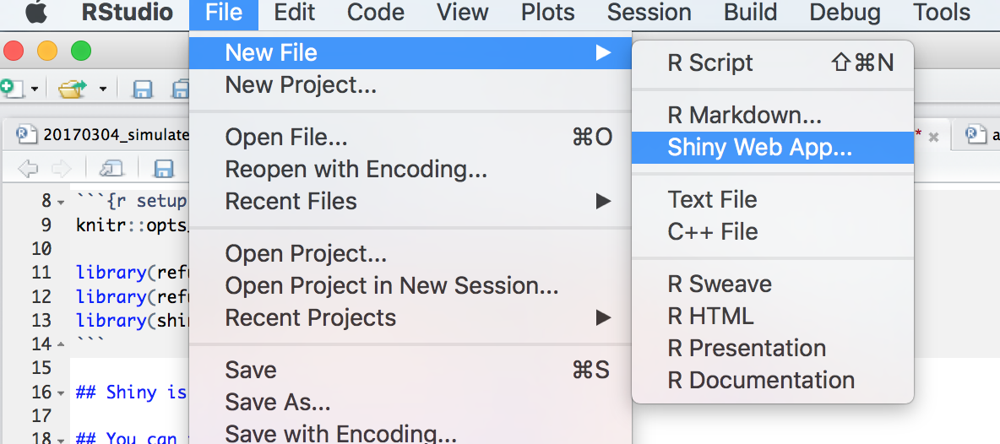

`Shiny` is RStudio's framework for creating interactive graphics and web-like applications. There are several ways to use the power of `Shiny` and we're going to focus on how to use it in conjunction with `flexdashboard` to make interactive dashboards within R Markdown.

This is the second module in the [Interactivity](topic_interactivity.html) topic; the relevant slack channel is [here](https://p8105-fall2017.slack.com/messages/C7RJ9G3SP).

```{r, echo = FALSE}
knitr::opts_chunk$set(
  collapse = TRUE,
  fig.width = 6,
  fig.asp = .6,
  out.width = "90%"
)
```


## Some slides

<script async class="speakerdeck-embed" data-id="c1b6fe0d9dd44fa494b5004c839798c2" data-ratio="1.33333333333333" src="//speakerdeck.com/assets/embed.js"></script>
<div style="margin-bottom:5px"> <strong> <a href="https://speakerdeck.com/jeffgoldsmith/dsi-shiny" title="Shiny" target="_blank">Shiny</a> </strong></div><br>


## Example

To gear up for this topic, we’ll create a directory, start an R Project, initialize git, and create a new `flexdashboard` document. Here is a [template](resources/shiny_dashboard_template.Rmd) for the `flexdashboard` we'll be creating today, go ahead and download that and put it in your directory.

```{r, echo = FALSE, comment = ""}
cat(htmltools::includeText("resources/shiny_dashboard_template.Rmd"))
```

Notice that we have added `runtime: shiny` to the YAML header. We are also using slightly different layout than we used in the last class. We have a sidebar column, spaces for plots are in rows instead of columns, and we have tabsets. 

Add the following libraries to your dashboard.

```{r}
library(tidyverse)
library(janitor)
library(stringr)
library(forcats)
library(viridis)

library(plotly)

library(shiny)
```

Once again we're going to focus on the [Airbnb](dataset_airbnb.html) data for this topic. The goal is to make a dashboard similar to the one from the last lecture but with additional interactive elements. The code below extracts, loads and cleans the data, and selects only a few of the variables. 

```{r import_data}
set.seed(1)

airbnb_data = read_csv("./data/nyc_airbnb.zip") %>%
  clean_names() %>%
  mutate(rating = review_scores_location / 2) %>%
  select(boro = neighbourhood_group, neighbourhood, rating, price, room_type,
         latitude, longitude) %>%
  filter(!is.na(rating)) 
```

We are going to filter the dataset interactively by taking user input, and use this dataset as the basis for our plots.

### selectInput widget

We will place code for widgets in the sidebar, but this is a choice and they can be placed elsewhere in the dashboard. The `selectInput` widget creates a drop-down menu with choices for the user to select from. We will render the plots in the rows.

```{r, eval = FALSE}
boros = airbnb_data %>% distinct(boro) %>% pull()

# selectInput widget
selectInput("boro_choice", label = h3("Select boro"),
            choices = boros, selected = "Manhattan")
```

Now we can select each of the different boros in New York. But how do we use this to update our dataset or plot?

```{r, eval = FALSE}
renderPrint({ 
  input$boro_choice
})
```

We see that the user-select boro is stored as a string 'under the hood'. 

### sliderInput widget

What would the `renderPrint` return if we wanted the user to select a numeric value? Let's add another widget and find out.

```{r, eval = FALSE}
max_price = 1000
min_price = airbnb_data %>% distinct(price) %>% min()
  
# sliderInput widget
sliderInput("price_range", label = h3("Choose price range"), min = min_price, 
        max = max_price, value = c(100, 400))
```

### radioButtons widget

Let's add one more widget and then build out the plots.

```{r, eval = FALSE}
room_choice = airbnb_data %>% distinct(room_type) %>% pull()

# radioButtons widget
radioButtons("room_choice", label = h3("Choose room type"),
    choices = room_choice, 
    selected = "Entire home/apt")
```

This last widget provides a button which allows the user to select among the types of rooms. For other types of widgets check out the [widget gallery](https://shiny.rstudio.com/gallery/widget-gallery.html).

### Interactive scatterplot

We start with the same `plot_ly` scatter plot we used in the last class. The only difference is now we will wrap it in a `renderPlotly` call. Go ahead and replace the `renderText` with the code below in your `flexdashboard`.

```{r, eval = FALSE}
renderPlotly({ 
  airbnb_data %>%
  mutate(text_label = str_c("Price: $", price, '\nRating: ', rating)) %>% 
  plot_ly(x = ~longitude, y = ~latitude, type = "scatter", mode = "markers",
          alpha = 0.5, 
          color = ~price,
          text = ~text_label)
})
```

The plot shows up, but in order to get it to change along with user input options from the sidebar, we need to add some Shiny `input$` calls.  

Here's a code chunk that incorporates the user input.

```{r, eval = FALSE}
renderPlotly({
    airbnb_data %>%
    filter(boro == input$boro_choice, 
           price %in% input$price_range[1]:input$price_range[2],
           room_type == input$room_choice) %>%
    mutate(text_label = str_c("Price: $", price, '\nRating: ', rating)) %>% 
    plot_ly(x = ~longitude, y = ~latitude, type = "scatter", mode = "markers",
          alpha = 0.5, 
          color = ~price,
          text = ~text_label)
})
```


### Interactive barchart

Similarly, we'll take the boxplot code from last lecture, add it to our dashboard, and edit the code so it incorporates user input. 

```{r, eval = FALSE}
renderPlotly({
  airbnb_data %>% 
  count(neighbourhood) %>% 
  mutate(neighbourhood = fct_reorder(neighbourhood, n)) %>% 
  plot_ly(x = ~neighbourhood, y = ~n, color = ~neighbourhood, type = "bar")
})
```

Notice that neighborhoods change with choice of boro.

### Interactive boxplot

Lastly, we'll make the boxplot from last lecture and add in the Shiny user input elements. I've provided the code below.

```{r, eval = FALSE}
renderPlotly({ 
  common_neighborhoods =
    airbnb_data %>% 
    filter(boro == input$boro_choice,
           price %in% input$price_range[1]:input$price_range[2],
           room_type == input$room_choice) %>%
    count(neighbourhood, sort = TRUE) %>% 
    top_n(8) %>% 
    select(neighbourhood)

  airbnb_data %>%
    filter(boro == input$boro_choice,
                          price %in% input$price_range[1]:input$price_range[2],
                          room_type == input$room_choice) %>%
    inner_join(., common_neighborhoods, by = "neighbourhood") %>% 
    plot_ly(y = ~price, color = ~neighbourhood, type = "box",
          colors = "Set2")
  
})
```

Now you have a `flexdashboard` with Shiny elements! 

### Hosting Shiny documents

[This file](./resources/shiny_dashboard.zip) contains a finalized Shiny flexdashboard based on the code snippets and layout above. Running this code will produce a local instance of the dashboard, with interactivity enabled.

_However_, you can't email Shiny-based HTML files like you can a static HTML file generated by R Markdown. This is because Shiny-based documents need to run `R` locally. However, you can host them through [Shinyapps.io](https://www.shinyapps.io/). A slightly fancier version of the Shiny-based `flexdashboard` for this class is hosted [here](https://julia-wrobel.shinyapps.io/airbnb_dashboard/). Check it out!

### Shiny apps

So far we've focused on adding Shiny to `flexdashboard`. We refer to our completed dashboard as a _Shiny document_.  However, there other ways to use Shiny! The most common way is to make a Shiny _application_, or _app_. So you know how these work, we're going to make a super simple one and deploy it. If you are interested in making a more complicated _Shiny app_, I've included some resources below.

Shiny apps use **.R** files, rather than **.Rmd**. You can initialize a Shiny app right from R Studio! Let's do that now.



Make sure to set a new directory for your app. Let's put an R project in there too, and open up that R project. In order to deploy the app, you can either open the file, and click the **RunApp** button, or run the following line of code in your console:

```{r, eval = FALSE}
shiny::runApp("../my_app")
```


## Other materials

* For more on using flexdashboards with Shiny, here's a [tutorial](http://rmarkdown.rstudio.com/flexdashboard/shiny.html)
* There are also several [examples](http://rmarkdown.rstudio.com/flexdashboard/examples.html) of people making these types flexdashboards, many which incorporate Shiny
* Hosting your shiny app or document online through [shinyapps.io](https://shiny.rstudio.com/articles/shinyapps.html).
* For more on making Shiny apps, check out R Studio's [tutorial](https://shiny.rstudio.com/tutorial/), or [this one](https://deanattali.com/blog/building-shiny-apps-tutorial/)


